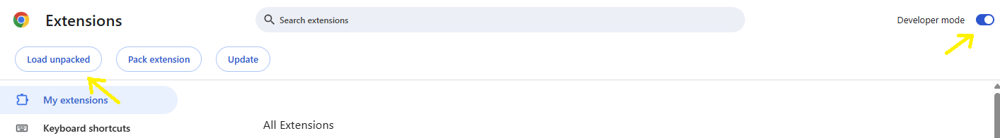
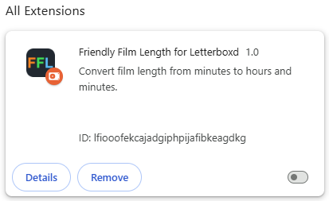

# 'Friendly Film Length' for Letterboxd

This is a Chrome extension for [Letterboxd](https://letterboxd.com/) to convert the film lengths from minutes to the more friendly format of hours and minutes.

## Installation

This extension is not available on the [Chrome Web Store](https://chromewebstore.google.com/) yet, so the only way to use it by now is by cloning this repository into your local computer and load it on Chrome:

```
git clone https://github.com/HaraldoFilho/ChromeExtensions.git
```

On Chrome type _chrome://extensions/_ on the address bar and on Extensions page, turn on the option **Developer mode** at the top right corner and click on **Load unpacked** at the top left corner.



Select the directory 'FriendlyFilmLength' of the extensions repository and the extension will appear on the **All extensions** list.



## Usage

Just load the extension and every time you visit a film page on Letterboxd the film length will be automatically converted!
